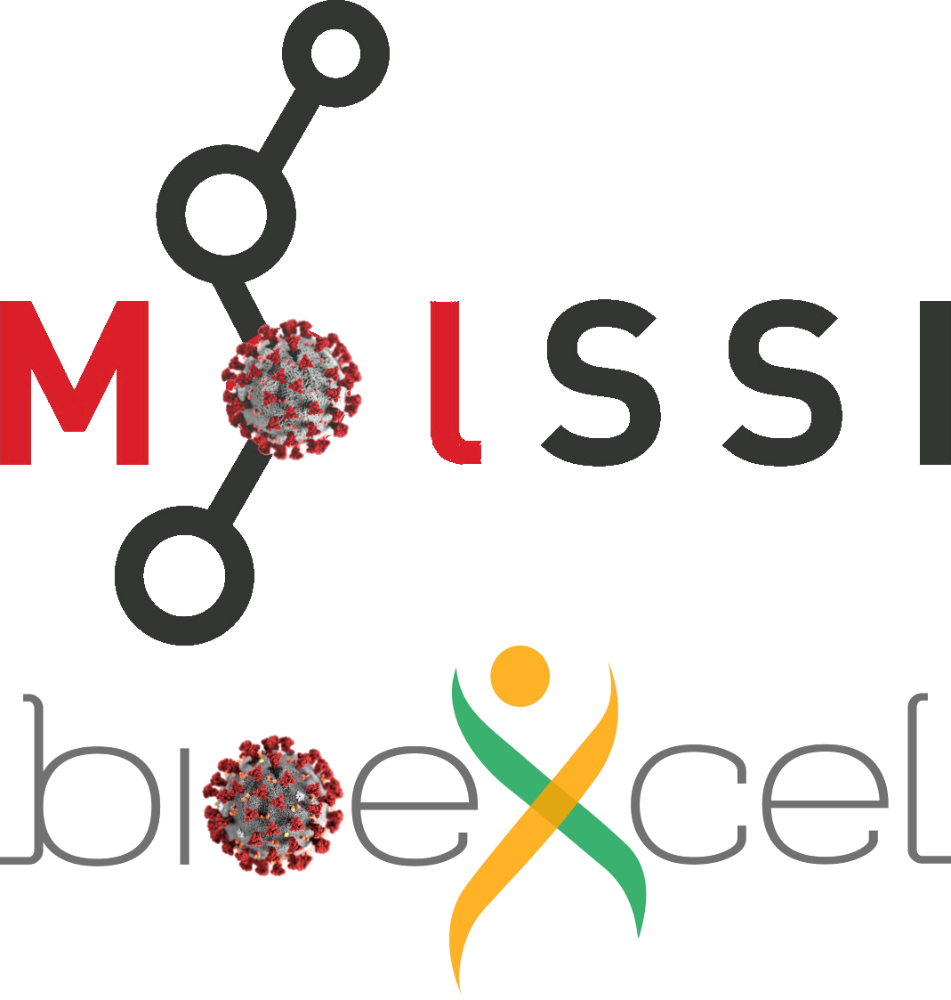

# COVID-19 Molecular Structure and Therapeutics Hub

A community data repository and curation service for Structure, Models, Therapeutics, Simulations 
related computations for research into the SARS-CoV-2 / COVID-19 / ”Coronavirus” pandemic maintained 
by [The Molecular Sciences Software Institute (MolSSI)](https://molssi.org) and 
[BioExcel](https://bioexcel.eu/). 
This virus has spurred the entire scientific world into action looking for treatments and answers to 
help minimize its spread, its symptoms, and its fatalities. 
To help researchers and the community quickly provide their resources and expertise, 
this repository is meant to serve as a curated central repository of MM and MD input files, 
trajectories, analysis scripts, well-validated algorithms, and related data for immediate community 
access.

This project may serve as a prototype into a future, more general Hub of structural and simulation Data 
project. There may come a time as this project evolves that it naturally does become more general (or 
change to another specific focus), however, this project focuses on the SARS-CoV-2 pandemic for now and 
future evolutions can be dealt with as they arise. 

## [Go to the Website](https://covid.molssi.org/)

## A Central Reference for Community Simulation Data

The nature of this pandemic requires rapid, and flexible response. This repository, and the data 
within are designed to get the information out quickly. The repo seeks to provide the following information
in a centralized location:

* Structures
    * Provenance of structure including any modifications made. Will accept manually written provenance. 
      If modifications made by program, please include script along with pre-modified files and list of required 
      programs to re-generate.
* Models
    * Extensions of the structures which are ready to go in a drug discovery Pipeline
* Therapeutics
    * Known small molecules, drug-likes, and other therapeutics which have been tested for treating this virus
* Simulation Configuration Files
    * Programs required to run (minimal subset which gets all dependencies, with minimal versions), 
    * Basic script and/or working instructions to execute these configuration files, 
    * Structure files (required for non-internet accessible structures, e.g. not required for things on the 
      [Protein Data Bank](https://www.rcsb.org/))
* Analysis Data 
    * Complete set of any of the previous data and exact details for replication
    * Analysis scripts with placeholders for output trajectory files.
    * Pointers to the trajectories if possible
* Trajectories - Not accepted in their entirety to the GitHub repository, 
    * Pointers will be accepted and noted. (contact information, where it’s stored, how to request, URLs, etc)
    * Program used to generate this trajectory.
    * Structures (or links there to) which were used to initiate the simulation which yielded this trajectory.
    * Config files and or scripts which were used to run the simulation that generate the trajectory (if possible)
* Papers - as links
    * Links to preprints and publications
    * Inclusion of the files for the paper if they fall into the other categories above.
    * Notation of any simulation package or software used to get the data in the paper
    * Papers from multiple groups should be added in multiple folders (see [Contributing](#contributing) below)
* Movies - hyperlinks only, please do not include full movie files.
    * Links to long term-hosted movies (e.g. YouTube).
    * Structures (or links there to) which were used to initiate this movie.
    * Config files and or scripts which were used to run the simulation that generate the trajectory (if possible)
    * The trajectory which this movie references (if possible, see rules on Trajectories above)
* Algorithms - Well-validated and easily deployable algorithms such as functional Monte Carlo and machine learning methods and heuristic property calculators
    * Code Snippets
    * Programing Language (if restricted)
    * List of required software and minimal dependencies (if any)

Due to the rapidly evolving nature of this hub, organization and requirements may change with time. However, 
no changes to the repository will remove user-submitted data. The maintainers may reach out to the original 
contributor to ask for additional information as needed.  
 

## Contributing

The exchange gladly accepts any of the above types of data (and others if you propose a schema). 
Simply open a PR with the data you wish to submit following the Schema in each of the `/data/{TYPE}/README.md` files.
Data is submitted as YAML files into the `/data/{TYPE}/README.md` directory.

A new YAML file should be created for *every* new piece of data.

This structure is subject to change, but all changes will be made by a maintainer and the instructions 
updated accordingly.

## Want to join the collaboration?

MolSSI and BioExcel are working together on this project to de-duplicate efforts and to reach the broadest 
community possible. We are activley looking for other institutes, collaborators, consortia, and anyone who wants 
to be an active contributor to join us! 

Reach out to any of the maintainers below and lets work together to make this as helpful as possible! 

## Hub Maintainers 

* [The Molecular Sciences Software Institute (MolSSI)](https://molssi.org)
* [BioExcel](https://bioexcel.eu/)
* [Levi N. Naden (MolSSI)](https://github.com/lnaden)
* [Sam Ellis (MolSSI)](https://github.com/sjayellis)
* [Andrew Abi-Mansour (MolSSI)](https://github.com/Andrew-AbiMansour)

## Funding

MolSSI is funded by the NSF through ACI-1547580
